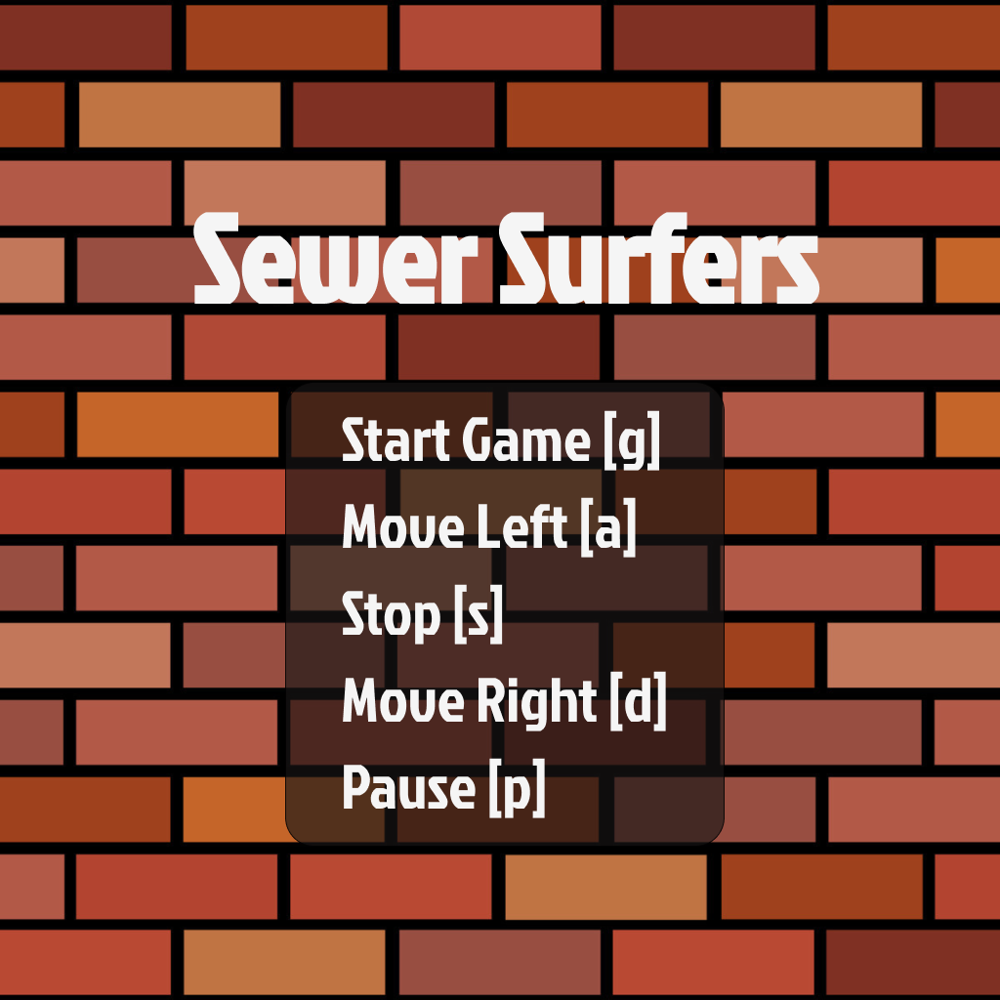
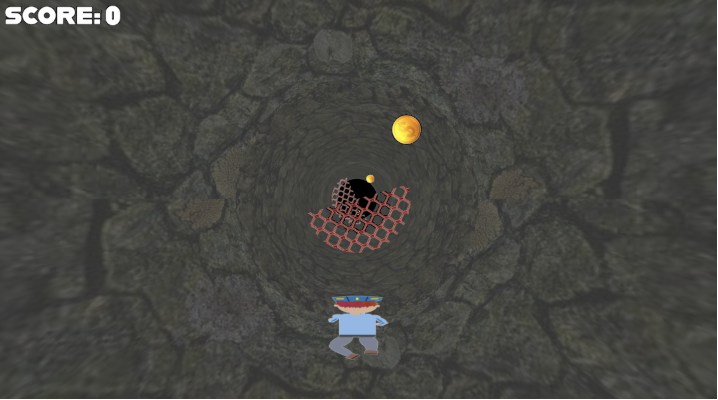

# CS174A Final Project: Sewer Surfers

**Team Members** : Ava Bronkar, Jenny Cho, Aaryaman Bhute

**Storyline/Theme**: 
    A burglar is on the loose with a bag of gold coins from a town's local bank. He is fleeing through a sewer tunnel, and it is your job as an officer to navigate through the tunnel and collect the gold coins without touching any of the barriers.

## Game Instructions 
You must control the movements of the officer character in the game using the following keyboard keys:
  * [g] Start Game
  * [a] Move the character left
  * [s] Stop the character
  * [d] Move the character right
  * [p] Pause the overall game

If you touch any of the barriers in the tunnel, the game ends immediately. You can use the following key to restart the game. However, you are not allowed to restart the game while you are still playing.
  * [r] Restart Game

As you navigate through the tunnel, collect the gold coins!

